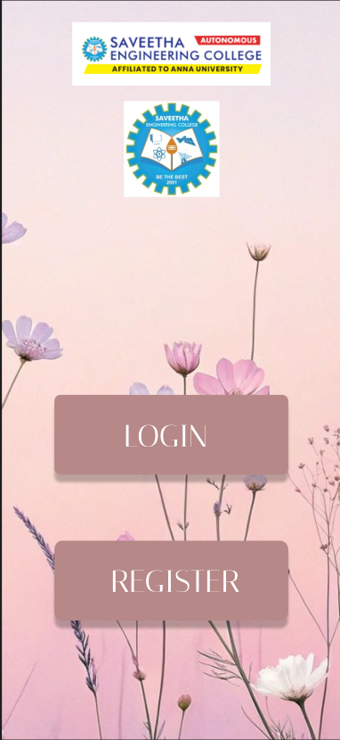
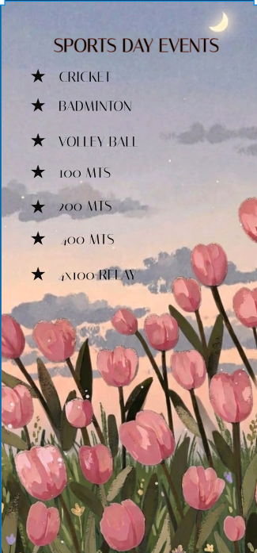
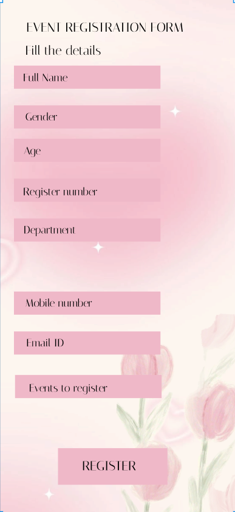
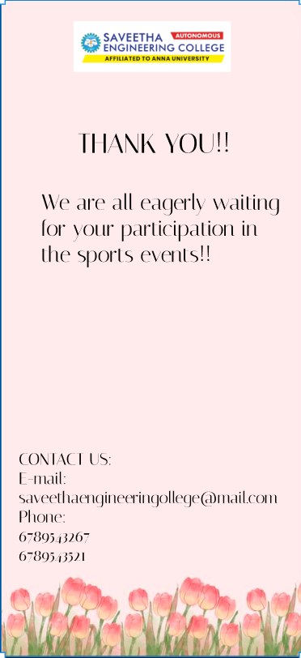

# Ex09 Event Registration Web Application
# Date: 31-08-26

# AIM:
To design, develop and deploy a web application for event registration.

# DESIGN STEPS:
## Step 1:
Create a new frame.

## Step 2:
Select any one preset size of your choice.

## Step 3:
Select the shapes you need.

## Step 4:
Import images as needed.

## Step 5:
Create pages based on your need and link them.

## Step 6:
Validate the HTML and CSS code.

## Step 6:
Publish the website in the given URL.

# DESIGN TOOL:
Figma

# CODE:

1. Page-1:

```
<html>
<head>
<meta name="viewport" content="width=device-width, initial-scale=1"/>
<meta charset="utf-8" />
<link rel="stylesheet" href="globals.css">
<link rel="stylesheet" href="style.css">
</head>
<body>
<div class="iphone-pro-max" >


<div class="text-wrapper" >LOGIN</div>
<div class="div" >REGISTER</div></div>
</body>
</html>
```

2. Page-2:

```
<html>
<head>
<meta name="viewport" content="width=device-width, initial-scale=1"/>
<meta charset="utf-8" />
<link rel="stylesheet" href="globals.css">
<link rel="stylesheet" href="style.css">
</head>
<body>
<div class="iphone-pro-max" ><div class="text-wrapper" >CRICKET</div>


<div class="div" >SPORTS DAY EVENTS</div>
<div class="text-wrapper-2" >CRICKET</div>
<div class="text-wrapper-3" >BADMINTON</div>
<div class="text-wrapper-4" >4x100 RELAY</div>
<div class="text-wrapper-5" >400 MTS</div>
<div class="text-wrapper-6" >200 MTS</div>
<div class="text-wrapper-7" >100 MTS</div>
<div class="text-wrapper-8" >VOLLEY BALL</div></div>
</body>
</html>
```

3. Page-3:

```
<html>
<head>
<meta name="viewport" content="width=device-width, initial-scale=1"/>
<meta charset="utf-8" />
<link rel="stylesheet" href="globals.css">
<link rel="stylesheet" href="styleguide.css">
<link rel="stylesheet" href="style.css">
</head>
<body>
<div class="iphone-pro-max" >
<div class="text-wrapper" >EVENT REGISTRATION FORM</div>
<div class="div" >Fill the details</div>
<div class="rectangle" ></div>
<div class="rectangle-2" ></div>
<div class="rectangle-3" ></div>
<div class="rectangle-4" ></div>
<div class="rectangle-5" ></div>

<div class="rectangle-6" ></div>
<div class="rectangle-7" ></div>
<div class="rectangle-8" ></div>
<div class="text-wrapper-2" >Full Name</div>
<div class="text-wrapper-3" >Gender</div>
<div class="text-wrapper-4" >Age</div>
<div class="text-wrapper-5" >Register number</div>
<div class="text-wrapper-6" >Department</div>
<div class="text-wrapper-7" >Mobile number</div>
<div class="text-wrapper-8" >Email ID</div>
<div class="text-wrapper-9" >Events to register</div>
<div class="text-wrapper-10" >REGISTER</div></div>
</body>
</html>
```

4. Page-4:

```
<!DOCTYPE html>
<html>
<head>
<meta name="viewport" content="width=device-width, initial-scale=1"/>
<meta charset="utf-8" />
<link rel="stylesheet" href="globals.css">
<link rel="stylesheet" href="style.css">
</head>

<body>
<div class="iphone-pro-max">
  
  
  <div class="text-wrapper">THANK YOU!!</div>
  <p class="div">
    We are all eagerly waiting for your participation in the sports events!!
  </p>
  <div class="CONTACT-US-e-mail">
    CONTACT US- e-Mail: savetheengineeringcollege@mail.com
    <br>
    Phone: 6789543267 / 6789543521
  </div>
</div>
</body>
</html>
```
# OUTPUT:









# RESULT:
The program to design, develop and deploy a web application for event registration is completed successfully.
